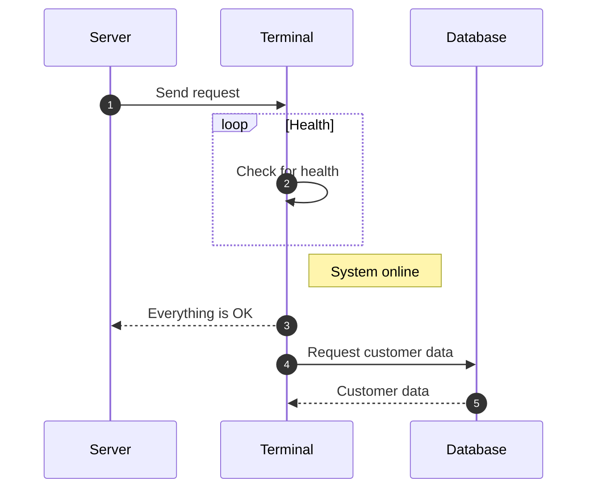

# Für wen ist ProManage?

ProManage ist eine Softwarelösung für mittelständige Unternehmen mit mehreren Teams. Sie dient der Unterstützung von Projektmanagern und Marketingabteilungen bei ihrer täglichen Arbeit.

1. Das ist ein Test zwei

!!! danger "Warnung"
      Hier ist was schiefgelaufen.

Collapsible admonition:

??? tip "Warnung (ausklappbar)"
      Hier ist was schiefgelaufen. Aber wenigstens kann man es aufklappen.

## Sequence Diagrams

!!! info "Info"
      Mermaid-Diagramm benötigt eine Markdown-Extension.

